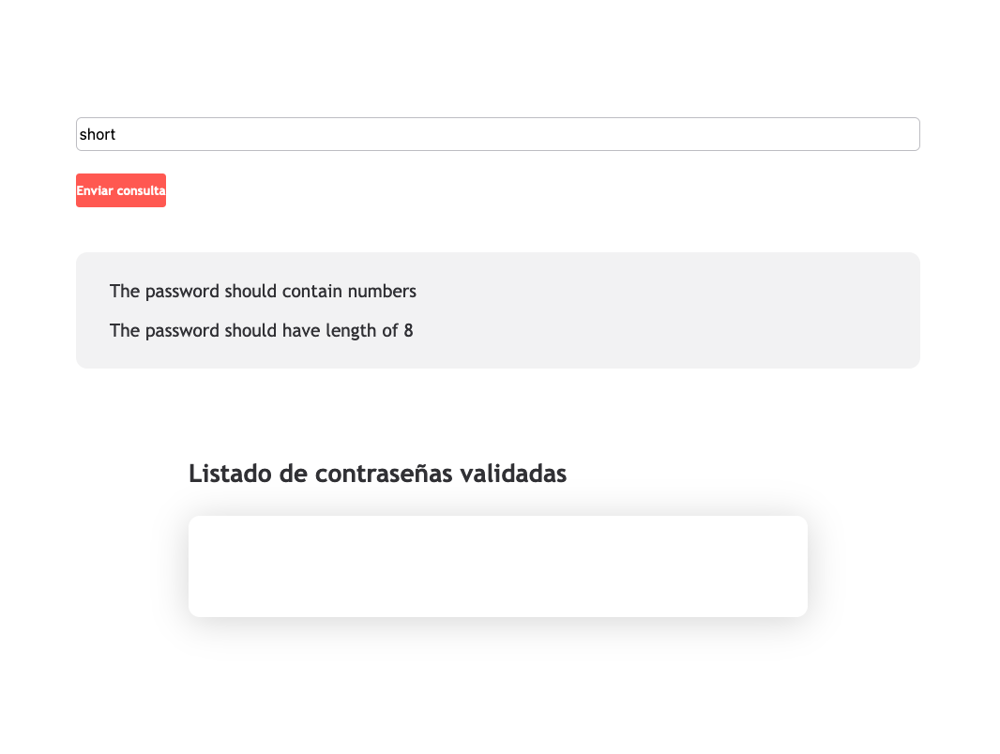
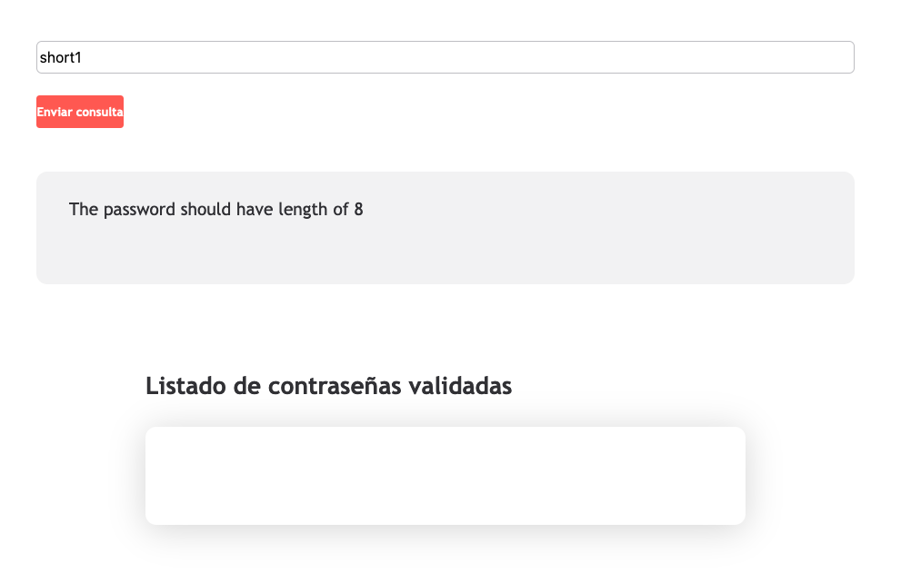
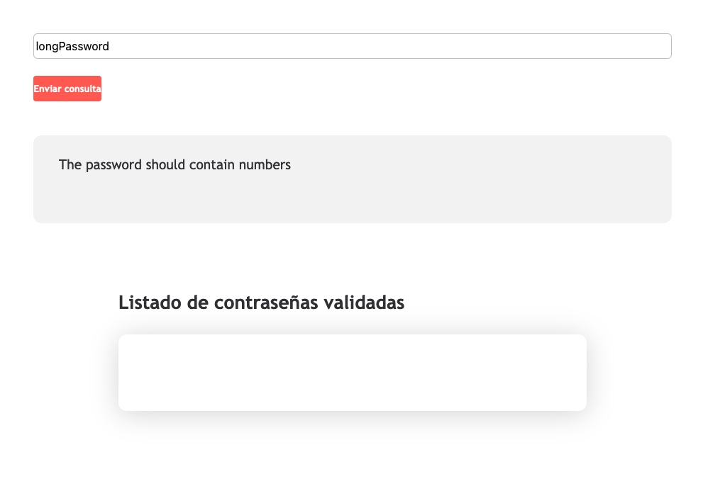
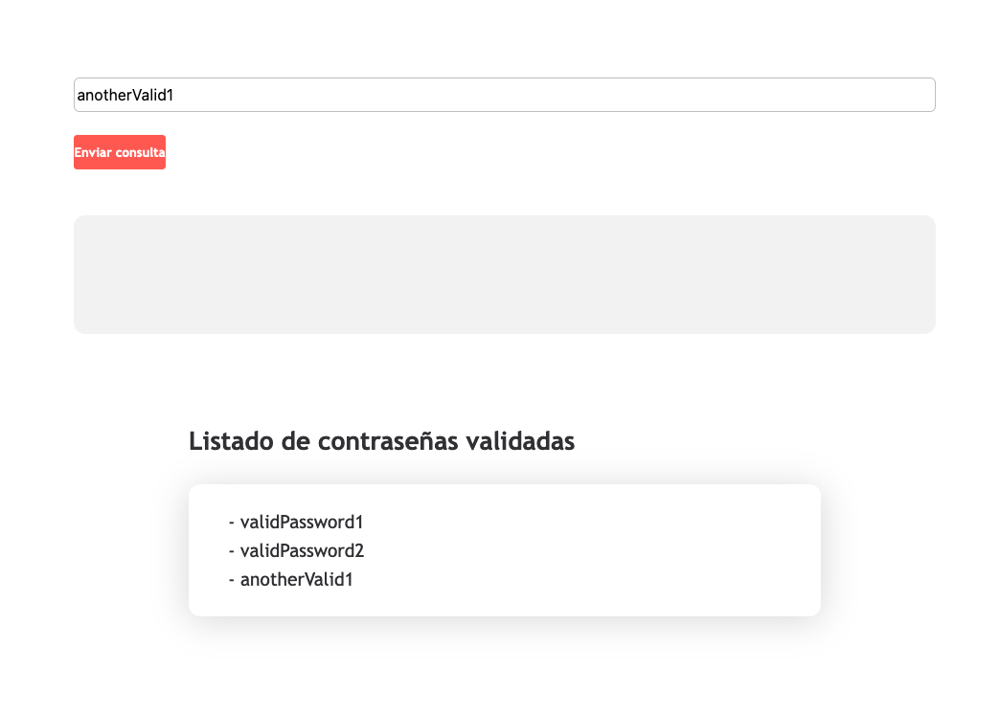

# Password validation - Frontend
En esta kata, vamos a resolver una versión adaptada y reducida de la kata [Password Validation](https://www.codurance.com/katalyst/password-validation) en Frontend.

## Objetivo
Implementar una página con un formulario en el que se puedan introducir contraseñas, y que al pulsar el botón de validar, si la contraseña es válida se muestre en un listado de contraseñas validadas de la página, y si la contraseña es inválida muestre los motivos en la página.

## Reglas
- La contraseña es inválida si:
  - La longitud es menor a 8 caracteres
  - La contraseña no contiene al menos un número
- Si la contraseña cumple los puntos anteriores, es válida
- Cuando la contraseña es válida, la página no debería mostrar motivos de contraseña inválida
- Si la contraseña es válida, debe mostrarse en la página en el listado de contraseñas válidas
- El listado al refrescar la página no tiene que persistir.

## Ejemplos

### Contraseña inválida: sin números y longitud menor a 8

### Contraseña inválida: longitud menor a 8

### Contraseña inválida: sin números

### Contraseñas válidas

