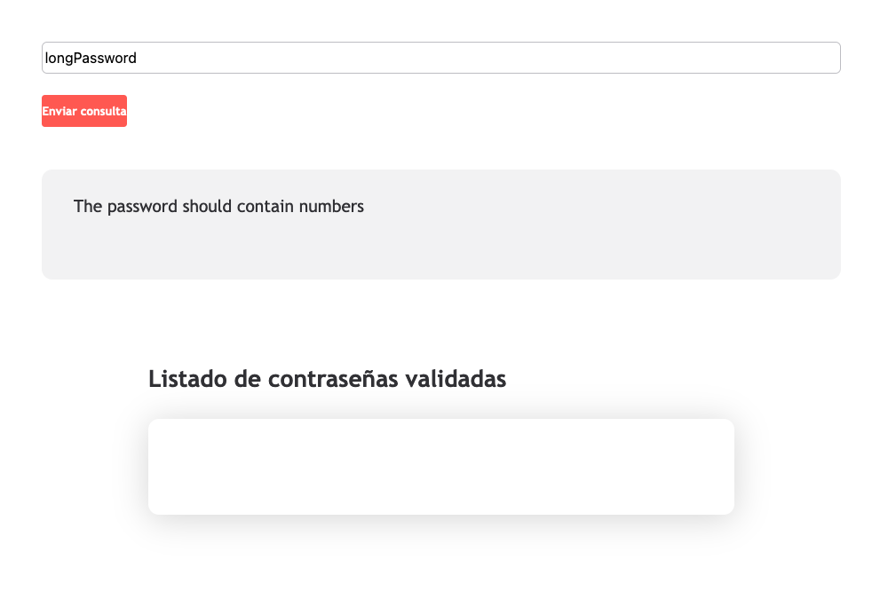
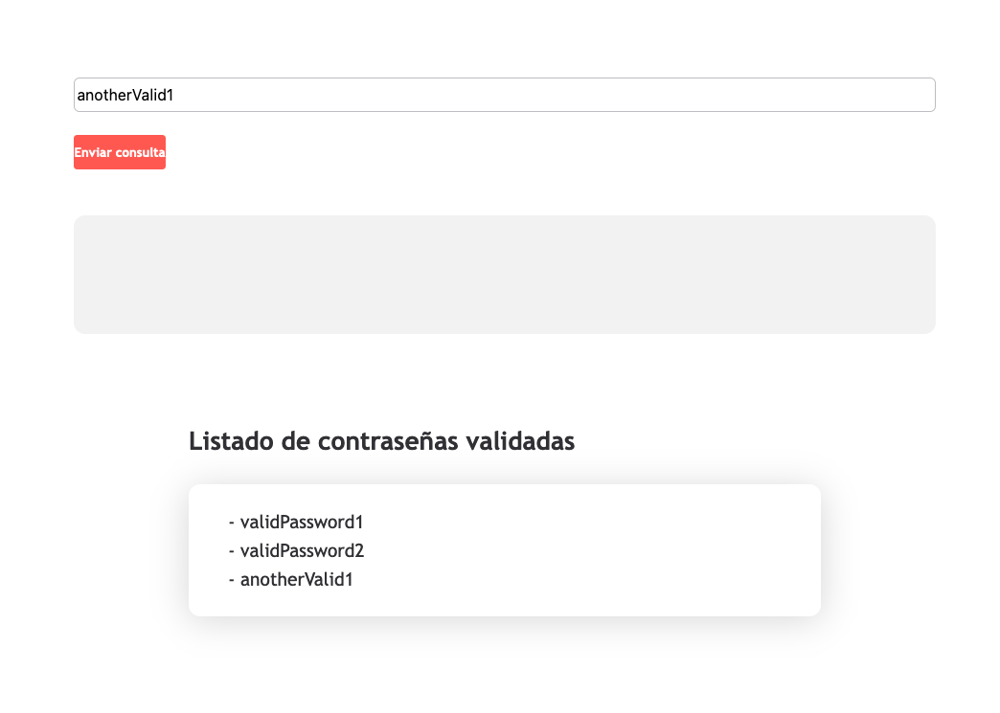

# Password validation - Frontend
En esta kata, vamos a resolver una versión adaptada y reducida de la kata [Password Validation](https://www.codurance.com/katalyst/password-validation) en Frontend.

## Objetivo
Implementar una página con un formulario en el que se puedan introducir contraseñas, y que al pulsar el botón de validar, si la contraseña es válida se muestre en un listado de contraseñas validadas de la página, y si la contraseña es inválida muestre los motivos en la página.

## Reglas
- La contraseña es inválida si:
  - La longitud es menor a 8 caracteres
  - La contraseña no contiene al menos un número
- Si la contraseña cumple los puntos anteriores, es válida
- Cuando la contraseña es válida, la página no debería mostrar motivos de contraseña inválida
- Si la contraseña es válida, debe mostrarse en la página en el listado de contraseñas válidas
- El listado al refrescar la página no tiene que persistir.

## Ejemplos

### Contraseña inválida: sin números y longitud menor a 8


### Contraseña inválida: longitud menor a 8


### Contraseña inválida: sin números


### Contraseñas válidas



# Vite setup

This template should help get you started developing with Vue 3 in Vite.

## Recommended IDE Setup

[VSCode](https://code.visualstudio.com/) + [Volar](https://marketplace.visualstudio.com/items?itemName=Vue.volar) (and disable Vetur) + [TypeScript Vue Plugin (Volar)](https://marketplace.visualstudio.com/items?itemName=Vue.vscode-typescript-vue-plugin).

## Type Support for `.vue` Imports in TS

TypeScript cannot handle type information for `.vue` imports by default, so we replace the `tsc` CLI with `vue-tsc` for type checking. In editors, we need [TypeScript Vue Plugin (Volar)](https://marketplace.visualstudio.com/items?itemName=Vue.vscode-typescript-vue-plugin) to make the TypeScript language service aware of `.vue` types.

If the standalone TypeScript plugin doesn't feel fast enough to you, Volar has also implemented a [Take Over Mode](https://github.com/johnsoncodehk/volar/discussions/471#discussioncomment-1361669) that is more performant. You can enable it by the following steps:

1. Disable the built-in TypeScript Extension
    1) Run `Extensions: Show Built-in Extensions` from VSCode's command palette
    2) Find `TypeScript and JavaScript Language Features`, right click and select `Disable (Workspace)`
2. Reload the VSCode window by running `Developer: Reload Window` from the command palette.

## Customize configuration

See [Vite Configuration Reference](https://vitejs.dev/config/).

## Project Setup

```sh
npm install
```

### Compile and Hot-Reload for Development

```sh
npm run dev
```

### Type-Check, Compile and Minify for Production

```sh
npm run build
```

### Run Unit Tests with [Vitest](https://vitest.dev/)

```sh
npm run test:unit
```

### Lint with [ESLint](https://eslint.org/)

```sh
npm run lint
```
